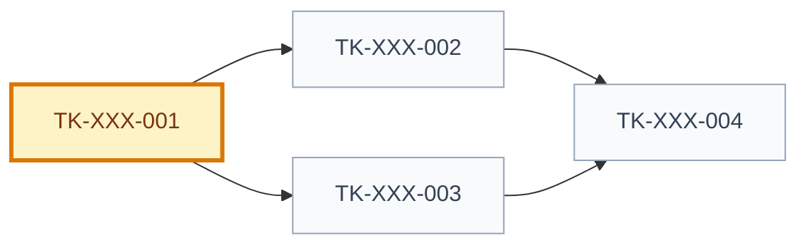

# Tasks Index: [use case name]

> Generated index. Do not edit manually.
> Source of truth: `execution-graph.json` and `tasks/<task-id>.md`.

## Snapshot

| Field | Value |
| --- | --- |
| ID | `[TASKSET-XXX]` |
| Status | `[draft | proposed | approved]` |
| Source graph | `[GRAPH-XXX]` |
| Source specification | `[SPEC-XXX]` |
| Generated from | `execution-graph.json` + `tasks/*.md` |
| Owner skill | Task AI |
| Next skill | Code Runner AI or QA AI |

## Navigation

| Artifact | Link |
| --- | --- |
| Context | [context.md](context.md) |
| Specification | [specification.md](specification.md) |
| Implementation Plan | [implementation-plan.md](implementation-plan.md) |
| Execution Graph | [execution-graph.json](execution-graph.json) |
| Tests | [tests.md](tests.md) |
| Audit | [audit.md](audit.md) |

## Delivery

| Field | Value |
| --- | --- |
| Level | `[L0 | L1 | L2 | L3 | L4 | L5 | N/A]` |
| Priority | `[P0 | P1 | P2 | P3 | N/A]` |
| Depends on | `[artifact ids/paths]` |
| Rationale | `[why this task set belongs here]` |

## Task Graph

## Task Files

| Task | File | Type | Depends On | Status | Acceptance |
| --- | --- | --- | --- | --- | --- |
| `TK-XXX-001` `[title]` | [tasks/TK-XXX-001.md](tasks/TK-XXX-001.md) | `[database/backend/frontend/test/analytics/docs/security]` | `[]` | `[draft/proposed/approved/in_progress/implemented/validated/released]` | `[observable check]` |

## Canonical Ownership

| Concern | Source of Truth |
| --- | --- |
| Dependency order | `execution-graph.json` |
| Task status | `tasks/<task-id>.md` |
| Task contract | `tasks/<task-id>.md` |
| Implementation links | `tasks/<task-id>.md` |
| Validation evidence | `tasks/<task-id>.md` and QA evidence artifacts |

## Blocked Tasks

| Task | Blocking Reason | Decision/Dependency Needed | Owner |
| --- | --- | --- | --- |
| `[task]` | `[reason]` | `[decision/dependency]` | `[role]` |

## Validation Methods

| Task | Validation |
| --- | --- |
| `[task]` | `[test/check/review]` |

## Parallelism Notes

- [Which tasks can run in parallel and why their write scopes do not overlap.]

## Handoff

| Field | Value |
| --- | --- |
| Ready for implementation | `[yes/no]` |
| Required next skill | `[skill]` |
| Notes | `[notes]` |
