# Tests: [use case name]

## 🧭 Snapshot

| Field | Value |
| --- | --- |
| ID | `[TEST-XXX]` |
| Status | `[draft | proposed | approved]` |
| Source specification | `[SPEC-XXX]` |
| Engineering System | `[ENGSYS-XXX @ semver | Not configured]` |
| Quality policy | `[engineering/quality/quality-system.md | Legacy quality model]` |
| Owner skill | QA AI |
| Next skill | QA AI for evidence or Security Review AI |

## 🎯 Test Goal

[Describe what confidence this test plan must provide.]

## Policy Application

| Field | Value |
| --- | --- |
| Applicable risks | `[behavior/data/permissions/UI/integration/performance/etc.]` |
| Environments | `[values configured in quality-system.yaml]` |
| Test data | `[classes configured in quality-system.yaml]` |
| Platforms | `[values configured in quality-system.yaml]` |
| Deviations or exceptions | `None` or `[open, unexpired, in-scope QEX-* ids]` |

## Acceptance Traceability

| Acceptance Criterion | Risk | Validation Method | Test Level | Evidence | Owner |
| --- | --- | --- | --- | --- | --- |
| `[AC-001]` | `[risk]` | `[automated/manual/review]` | `[unit/integration/contract/e2e/etc.]` | `[path/log/screenshot]` | `[task/skill]` |

## 🧪 Coverage Matrix

| Area | Required Coverage | Evidence Required | Status |
| --- | --- | --- | --- |
| Behavioral | `[main and alternate flows]` | `[test/evidence path]` | `[draft/proposed/approved]` |
| Permissions/security | `[checks]` | `[test/evidence path]` | `[status]` |
| Data | `[constraints and mutations]` | `[test/evidence path]` | `[status]` |
| UX states | `[states]` | `[test/evidence path]` | `[status]` |
| Accessibility | `[requirements]` | `[test/evidence path]` | `[status]` |
| Analytics/observability | `[events/logs/metrics]` | `[test/evidence path]` | `[status]` |
| Performance/reliability | `[expectations]` | `[test/evidence path]` | `[status]` |

## 🗺️ Test Flow

```mermaid
flowchart LR
  A["Fixtures"] --> B["Behavior tests"]
  B --> C["Permission tests"]
  C --> D["Security evidence"]
  D --> E["UX and accessibility checks"]
  E --> F["Analytics assertions"]
  F --> G["QA evidence"]
  G --> H["QA verdict"]

  classDef done fill:#dcfce7,stroke:#16a34a,color:#14532d;
  classDef current fill:#fef3c7,stroke:#d97706,color:#78350f,stroke-width:3px;
  classDef pending fill:#f8fafc,stroke:#94a3b8,color:#334155;
  classDef blocked fill:#fee2e2,stroke:#dc2626,color:#7f1d1d;

  class A done;
  class B current;
  class C,D,E,F,G,H pending;
```

## ✅ Test Cases

| Test | Preconditions | Steps | Expected Result |
| --- | --- | --- | --- |
| `[test name]` | `[preconditions]` | `[steps]` | `[result]` |

## 🔎 Evidence Requirements

| Requirement | Evidence Type | Required For Validation |
| --- | --- | --- |
| Every acceptance criterion maps to at least one validation method. | `[test/log/screenshot/review]` | yes |
| Every task marked done has validation evidence. | `[test/log/review]` | yes |
| Security and privacy controls have explicit evidence or a documented N/A. | `[test/security review/manual evidence]` | yes |
| Failed tests and blockers have fix verification evidence. | `[test rerun/review]` | yes |

## 🔐 Security Test Matrix

| Control | Scenario | Expected Result | Evidence |
| --- | --- | --- | --- |
| Authorization | `[unauthorized actor/action]` | `[denied/logged]` | `[path]` |
| Privacy | `[sensitive data path]` | `[not exposed/minimized]` | `[path]` |
| Abuse/replay | `[abuse scenario]` | `[limited/rejected/idempotent]` | `[path]` |
| Safe logging | `[failure/success event]` | `[no sensitive data leaked]` | `[path]` |

## ⚠️ Residual Risk

| Risk | Why It Remains | Mitigation |
| --- | --- | --- |
| `[risk]` | `[reason]` | `[mitigation]` |

## 🏁 QA Result

| Field | Value |
| --- | --- |
| Verdict | `[passed | passed_with_notes | blocked]` |
| Required fixes | `[fixes]` |
| QA evidence | [qa-evidence.md](qa-evidence.md) |
| Security review | [security-review.md](security-review.md) |
| Next owner | `[role/skill]` |
