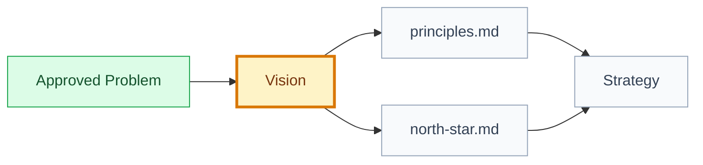

# Vision: [product or area name]

## 🧭 Snapshot

| Field | Value |
| --- | --- |
| ID | `[VIS-XXX]` |
| Type | `vision` |
| Parent IDs | `[PROB-XXX]` |
| Status | `[draft | proposed | approved]` |
| Source problem | `[PROB-XXX/path]` |
| Owner skill | Vision AI |
| Next skill | Strategy AI |

## 🌟 Vision Statement

[Describe the product future, for whom, why now, and what durable outcome it should create.]

## 👥 Target Users

| User | Desired Outcome | Current Friction |
| --- | --- | --- |
| `[user segment]` | `[outcome]` | `[friction]` |

## 🧭 Companion Contracts

| Contract | Canonical Artifact |
| --- | --- |
| Product principles, trade-offs, examples, and anti-principles | `principles.md` |
| North-star outcome, metric, measurement notes, and guardrails | `north-star.md` |

## 🗺️ Vision To Strategy Flow

## 🚫 Non-Goals

- [What this vision does not include.]

## 🔐 Decisions Needed

| Decision | Blocks | Owner |
| --- | --- | --- |
| `[decision]` | `[artifact]` | `[role]` |

## 🏁 Approval

| Field | Value |
| --- | --- |
| Approved by |  |
| Date |  |
| Notes |  |
