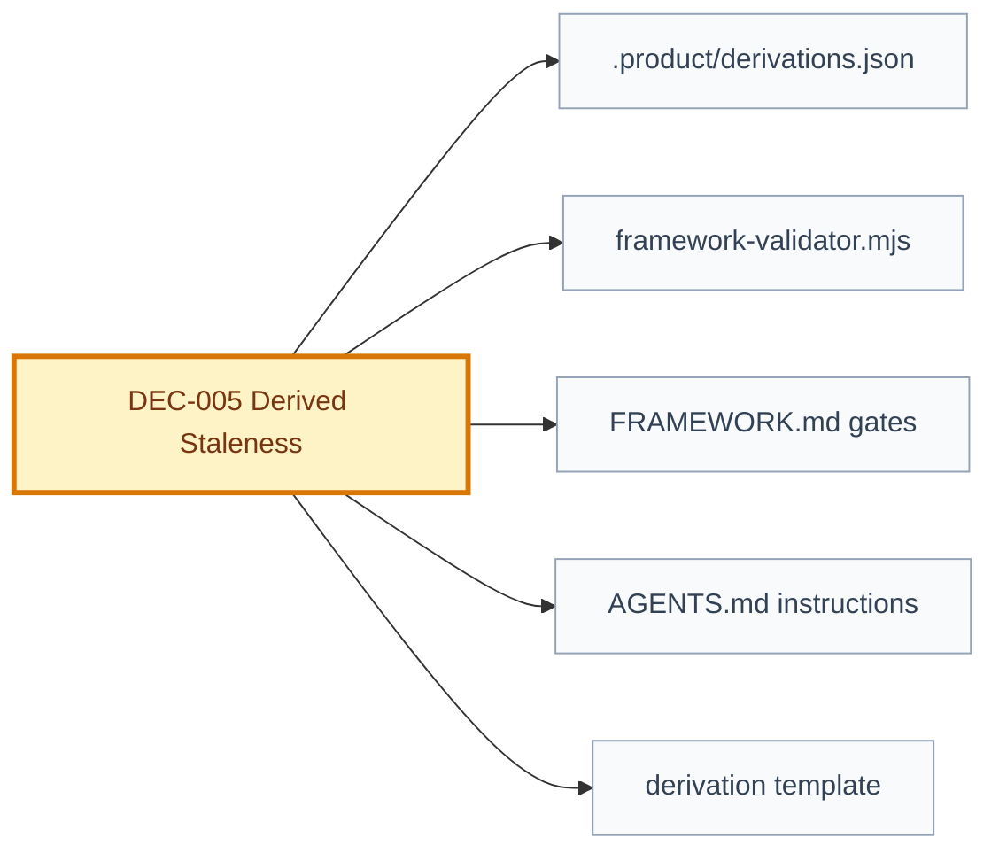

# Decision: Derived Staleness

## Snapshot

| Field | Value |
| --- | --- |
| ID | DEC-005 |
| Status | approved |
| Date | 2026-07-09 |
| Scope | governance/traceability/validation |
| Owner | Product Engineering Framework |

## Decision

Staleness is a validator-derived condition, not an editable artifact status.

Artifacts keep their normal framework status values. The validator determines whether an artifact is stale by comparing the current normalized SHA-256 hash of its declared source artifacts against the source hashes captured when the artifact was derived.

The source hash algorithm is the same one used by approval records:

- convert line endings to LF;
- remove trailing spaces and tabs from each line;
- hash the whole normalized file with SHA-256.

The initial derivation baseline is stored in [.product/derivations.json](../../.product/derivations.json). Each entry records an artifact, its path, and the parent/source artifact hashes it was derived from.

Any content change after normalization invalidates descendants that reference the old hash. The framework does not try to distinguish editorial changes from semantic changes in this phase. The fast path is human re-approval or regeneration of downstream artifacts.

## Why

The framework already tracks parent and child relationships, but downstream artifacts do not know which version of their source they were generated from. A Specification can change after Design, Plan, Graph, Tasks, Tests, QA Evidence, or Security Review were created, and nothing currently tells the validator that those descendants may be stale.

Derived staleness closes that gap while preserving the existing status model.

## Options Considered

| Option | Pros | Cons | Result |
| --- | --- | --- | --- |
| Add `stale` as an editable status | Easy to read in YAML | Conflicts with status model and can be manually flipped | Rejected |
| Store source hashes in every artifact file | Local and explicit | Noisy migration across many existing docs | Rejected for this phase |
| Store derivation metadata centrally | Retrocompatible and machine-friendly | Requires validator to maintain an index | Chosen |
| Compare only semantic sections | Less churn from editorial edits | Hard to define consistently and easy to miss changes | Rejected for now |

## Decision Impact Flow

## Consequences

| Type | Consequence | Follow-up |
| --- | --- | --- |
| Positive | Downstream artifacts can no longer silently rely on changed parent content. | Validator reports stale derivations. |
| Positive | Reuses the approval-record hash model. | Keep hash utility shared in the validator. |
| Negative | Any normalized content change invalidates downstream, including editorial edits. | Human can re-approve or regenerate quickly. |
| Negative | Central metadata must stay in sync when artifacts are regenerated or moved. | EV-006 move tooling should update derivations. |

## Affected Artifacts

| Artifact | Required Update |
| --- | --- |
| [FRAMEWORK.md](../../FRAMEWORK.md) | Reference derived staleness as a gate blocker. |
| [AGENTS.md](../../AGENTS.md) | Instruct agents to report stale artifacts instead of flipping status. |
| [framework-validator.mjs](../../engineering/validators/framework-validator.mjs) | Validate derivation hashes. |
| [.product/derivations.json](../../.product/derivations.json) | Store baseline derivation metadata. |
| [derivation-record-template.json](../templates/derivation-record-template.json) | Provide machine-readable template. |

## Supersedes

- N/A

## Approval

| Field | Value |
| --- | --- |
| Approved by | JonatasFreireDev |
| Date | 2026-07-09 |
| Approval record | [.product/history/approval-DEC-005-approved-pending.json](../../.product/history/) |
| Notes | Approved by user instruction: `APROVAR EVOLUÇÃO EV-004`. |
