# Knowledge Templates

## Purpose

This folder stores reusable artifact templates for the Product Engineering Framework. Templates keep the document chain consistent from Problem through Tasks without changing the architecture defined in `FRAMEWORK.md`.

## When To Use

Use these templates whenever a new canonical artifact is created or an existing artifact must be normalized. A template is not a substitute for product thinking; it is the checklist that keeps the output traceable, auditable, and ready for the next skill.

## Expected Files

- `context-template.md`: baseline for every `context.md`.
- `problem-template.md`, `vision-template.md`, `strategy-template.md`: foundation artifacts.
- `persona-template.md`, `metric-template.md`, `roadmap-item-template.md`: strategy support artifacts.
- `domain-template.md`, `goal-template.md`, `feature-template.md`, `use-case-template.md`: product hierarchy artifacts.
- `journey-template.md`: user journey artifact.
- `specification-template.md`, `design-template.md`, `implementation-plan-template.md`: planning contracts.
- `execution-graph-template.json`, `tasks-template.md`, `tests-template.md`: executable planning artifacts.
- `analytics-template.md`, `audit-template.md`, `readiness-report-template.md`: validation and measurement artifacts.
- `decision-template.md`, `release-template.md`: human approval, decision, and release artifacts.

## Responsible Skill

Primary owner: Documentation Writer AI.

Supporting skills: Product Historian AI for decisions, Specification AI for specification completeness, UX/UI AI for design coverage, Task AI for executable task structure.

## Visual Standard

Templates should produce artifacts that are easy to scan in GitHub and Codex:

- use a `🧭 Snapshot` table near the top;
- use status icons such as `✅`, `🟡`, `🔴`, and `➖` where a report or gate has a result;
- use tables for scope, decisions, risks, dependencies, owners, and acceptance;
- use Mermaid diagrams for flows, artifact chains, gates, journeys, and dependencies;
- keep prose focused on decisions, evidence, and handoff.

## Mermaid Progress Classes

When a Mermaid flow represents framework progress, include visual classes:

```mermaid
flowchart LR
  A["Problem"] --> B["Vision"] --> C["Strategy"] --> D["Domain"] --> E["User Goal"] --> F["Feature"] --> G["Use Case"] --> H["Specification"] --> I["Design"] --> J["Implementation Plan"] --> K["Execution Graph"] --> L["Tasks"]

  classDef done fill:#dcfce7,stroke:#16a34a,color:#14532d;
  classDef current fill:#fef3c7,stroke:#d97706,color:#78350f,stroke-width:3px;
  classDef pending fill:#f8fafc,stroke:#94a3b8,color:#334155;
  classDef blocked fill:#fee2e2,stroke:#dc2626,color:#7f1d1d;

  class A,B,C,D,E,F,G done;
  class H current;
  class I,J,K,L pending;
```

Responsibility:

| Owner | Responsibility |
| --- | --- |
| Skill that owns the current artifact | Update the local Mermaid flow and `context.md` when artifact status changes. |
| Documentation Orchestrator | Synchronize Mermaid progress across reports, templates, indexes, and context files. |
| Audit Orchestrator | Verify visual state matches real artifact status during audits. |
| Release Orchestrator | Verify release/readiness visual flows before release approval. |

## Next Step

When creating an artifact, read the relevant parent `context.md`, copy the matching template structure into the target document, replace placeholders with concrete content, and leave the artifact in `draft` or `proposed` until human approval is recorded.
