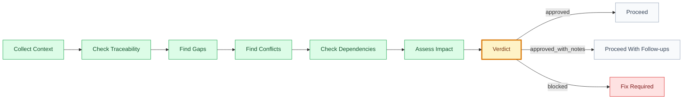

# Audit: [scope]

## 🧭 Executive Snapshot

| Field | Value |
| --- | --- |
| Scope | `[domain/goal/feature/use-case/release]` |
| Auditor skill | `[skill]` |
| Date | `[YYYY-MM-DD]` |
| Verdict | `[✅ approved | 🟡 approved_with_notes | 🔴 blocked]` |
| Next owner | `[skill/person]` |

## 🗺️ Audit Flow

## 📌 Summary

[Short summary of what was checked and result.]

## 🚦 Verdict Matrix

| Area | Result | Evidence | Notes |
| --- | --- | --- | --- |
| Traceability | `[✅/🟡/🔴]` | `[path/section]` | `[note]` |
| Completeness | `[✅/🟡/🔴]` | `[path/section]` | `[note]` |
| Consistency | `[✅/🟡/🔴]` | `[path/section]` | `[note]` |
| Dependencies | `[✅/🟡/🔴]` | `[path/section]` | `[note]` |
| Security/privacy | `[✅/🟡/🔴/➖]` | `[path/section]` | `[note]` |
| UX/accessibility | `[✅/🟡/🔴/➖]` | `[path/section]` | `[note]` |
| Release readiness | `[✅/🟡/🔴/➖]` | `[path/section]` | `[note]` |

## 🔎 Findings

| Severity | Finding | Evidence | Impact | Required Fix | Owner |
| --- | --- | --- | --- | --- | --- |
| `[🔴 blocker/🟡 warning/🔵 note]` | `[finding title]` | `[file/path/section]` | `[why it matters]` | `[fix]` | `[role]` |

## 🧱 Gaps

| Gap | Blocks | Required Fix | Owner |
| --- | --- | --- | --- |
| `[gap]` | `[artifact/task]` | `[fix]` | `[role]` |

## ⚔️ Conflicts

| Conflict | Artifacts | Impact | Resolution Needed |
| --- | --- | --- | --- |
| `[conflict]` | `[paths]` | `[impact]` | `[decision/fix]` |

## 🔗 Dependencies

| Dependency | Required By | Status | Risk |
| --- | --- | --- | --- |
| `[dependency]` | `[artifact/task]` | `[open/ready/blocked]` | `[risk]` |

## 🔐 Decisions

| Decision | Status | Blocks | Owner |
| --- | --- | --- | --- |
| `[decision]` | `[open/proposed/approved]` | `[artifact/task]` | `[role]` |

## 🌡️ Residual Risk

| Risk | Likelihood | Impact | Mitigation |
| --- | --- | --- | --- |
| `[risk]` | `[low/medium/high]` | `[low/medium/high]` | `[mitigation]` |

## 🏁 Approval

| Field | Value |
| --- | --- |
| Approved by |  |
| Date |  |
| Notes |  |
