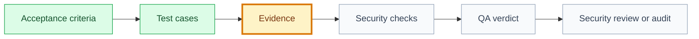

# QA Evidence: [use case name]

## 🧭 Snapshot

| Field | Value |
| --- | --- |
| ID | `[QA-XXX]` |
| Status | `[draft | proposed | approved | validated]` |
| Source use case | `[UC-XXX]` |
| Source specification | `[SPEC-XXX]` |
| Source tests | `[TEST-XXX]` |
| Owner skill | QA AI |
| Next skill | Security Review AI or Audit Orchestrator |

## 🔗 Navigation

| Artifact | Link |
| --- | --- |
| Context | [context.md](context.md) |
| Specification | [specification.md](specification.md) |
| Implementation Plan | [implementation-plan.md](implementation-plan.md) |
| Execution Graph | [execution-graph.json](execution-graph.json) |
| Tasks | [tasks.md](tasks.md) |
| Tests | [tests.md](tests.md) |
| Security Review | [security-review.md](security-review.md) |
| Audit | [audit.md](audit.md) |

## 🗺️ QA Evidence Flow

## ✅ Acceptance Evidence Matrix

| Acceptance Criterion | Source | Validation Method | Evidence | Result |
| --- | --- | --- | --- | --- |
| `[AC-001]` | `[specification.md section]` | `[automated/manual/review]` | `[path/log/screenshot/test run]` | `[✅/🟡/🔴/➖]` |

## 🧪 Test Execution

| Test | Type | Command Or Method | Evidence | Result |
| --- | --- | --- | --- | --- |
| `[test id]` | `[unit/integration/e2e/manual/security/accessibility]` | `[command/method]` | `[path]` | `[passed/failed/blocked/not run]` |

## 🔐 Security And Privacy Evidence

| Control | Evidence | Result | Notes |
| --- | --- | --- | --- |
| Authorization | `[path/test/log]` | `[✅/🟡/🔴/➖]` | `[notes]` |
| Data privacy | `[path/test/log]` | `[✅/🟡/🔴/➖]` | `[notes]` |
| Abuse/edge cases | `[path/test/log]` | `[✅/🟡/🔴/➖]` | `[notes]` |
| Safe logging/analytics | `[path/test/log]` | `[✅/🟡/🔴/➖]` | `[notes]` |

## 🧯 Defects And Fix Verification

| Finding | Severity | Fix Evidence | Status |
| --- | --- | --- | --- |
| `[finding]` | `[blocker/high/medium/low]` | `[path]` | `[open/fixed/accepted]` |

## ⚠️ Residual Risk

| Risk | Why It Remains | Mitigation | Approval |
| --- | --- | --- | --- |
| `[risk]` | `[reason]` | `[mitigation]` | `[DEC-XXX/N/A]` |

## 🏁 QA Verdict

| Field | Value |
| --- | --- |
| Verdict | `[passed | passed_with_notes | blocked]` |
| Coverage complete | `[yes/no]` |
| Security evidence complete | `[yes/no]` |
| Blocks validation | `[yes/no]` |
| Blocks release | `[yes/no]` |
| Next owner | `[skill/role]` |
