# Security Review: [use case name]

## 🧭 Snapshot

| Field | Value |
| --- | --- |
| ID | `[SEC-XXX]` |
| Status | `[draft | proposed | approved | validated]` |
| Source use case | `[UC-XXX]` |
| Source specification | `[SPEC-XXX]` |
| Source QA evidence | `[QA-XXX or N/A]` |
| Owner skill | Security Review AI |
| Next skill | QA AI or Release Orchestrator |

## 🔗 Navigation

| Artifact | Link |
| --- | --- |
| Context | [context.md](context.md) |
| Specification | [specification.md](specification.md) |
| Design | [design.md](design.md) |
| Implementation Plan | [implementation-plan.md](implementation-plan.md) |
| Execution Graph | [execution-graph.json](execution-graph.json) |
| Tasks | [tasks.md](tasks.md) |
| Tests | [tests.md](tests.md) |
| QA Evidence | [qa-evidence.md](qa-evidence.md) |
| Audit | [audit.md](audit.md) |

## 🚚 Delivery

| Field | Value |
| --- | --- |
| Level | `[L0 | L1 | L2 | L3 | L4 | L5]` |
| Priority | `[P0 | P1 | P2 | P3]` |
| Depends on | `[artifact ids/paths]` |
| Rationale | `[why security review depth is required]` |

## 🗺️ Security Gate Flow

```mermaid
flowchart LR
  S["Specification security contract"] --> D["Design privacy states"]
  D --> P["Plan controls"]
  P --> G["Security graph nodes"]
  G --> Q["QA evidence"]
  Q --> R["Security review"]
  R --> A["Audit or release gate"]

  classDef done fill:#dcfce7,stroke:#16a34a,color:#14532d;
  classDef current fill:#fef3c7,stroke:#d97706,color:#78350f,stroke-width:3px;
  classDef pending fill:#f8fafc,stroke:#94a3b8,color:#334155;
  classDef blocked fill:#fee2e2,stroke:#dc2626,color:#7f1d1d;

  class S,D,P,G,Q done;
  class R current;
  class A pending;
```

## 🧱 Security Scope

| Area | In Scope | Out Of Scope |
| --- | --- | --- |
| Authentication | `[requirements]` | `[excluded behavior]` |
| Authorization | `[roles/actions]` | `[excluded behavior]` |
| Data and privacy | `[data classes]` | `[excluded data]` |
| Abuse prevention | `[abuse cases]` | `[excluded cases]` |
| Observability | `[logs/alerts/audit trail]` | `[excluded telemetry]` |

## 🧠 Threat Model Summary

| Threat | Actor | Impact | Required Control | Evidence |
| --- | --- | --- | --- | --- |
| `[threat]` | `[actor]` | `[impact]` | `[control]` | `[path/test/log]` |

## 🔐 Control Checklist

| Control | Expected Evidence | Result | Notes |
| --- | --- | --- | --- |
| Server-side authorization | `[test/log/code evidence]` | `[✅/🟡/🔴/➖]` | `[notes]` |
| Least privilege | `[role matrix]` | `[✅/🟡/🔴/➖]` | `[notes]` |
| Sensitive data minimization | `[data contract/log review]` | `[✅/🟡/🔴/➖]` | `[notes]` |
| Input validation | `[test/code evidence]` | `[✅/🟡/🔴/➖]` | `[notes]` |
| Abuse/replay/rate limits | `[test/design decision]` | `[✅/🟡/🔴/➖]` | `[notes]` |
| Secrets and tokens | `[scan/review evidence]` | `[✅/🟡/🔴/➖]` | `[notes]` |
| Safe logging and analytics | `[log/event review]` | `[✅/🟡/🔴/➖]` | `[notes]` |
| Rollback and monitoring | `[plan/runbook]` | `[✅/🟡/🔴/➖]` | `[notes]` |

## 🚦 Findings

| Severity | Finding | Evidence | Required Fix | Route | Owner |
| --- | --- | --- | --- | --- | --- |
| `[blocker/high/medium/low/note]` | `[finding]` | `[path]` | `[fix]` | `[bug-fixer/code-runner/qa/product-historian]` | `[owner]` |

## ⚠️ Residual Risks

| Risk | Severity | Mitigation | Approval Needed | Owner |
| --- | --- | --- | --- | --- |
| `[risk]` | `[low/medium/high]` | `[mitigation]` | `[yes/no/decision id]` | `[role]` |

## 🏁 Security Verdict

| Field | Value |
| --- | --- |
| Verdict | `[passed | passed_with_notes | blocked]` |
| Blocks validation | `[yes/no]` |
| Blocks release | `[yes/no]` |
| Required decisions | `[DEC-XXX or N/A]` |
| Next owner | `[skill/role]` |
