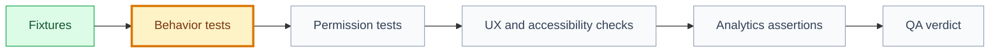

# Tests: [use case name]

## 🧭 Snapshot

| Field | Value |
| --- | --- |
| ID | `[TEST-XXX]` |
| Status | `[draft | proposed | approved]` |
| Source specification | `[SPEC-XXX]` |
| Owner skill | QA AI |
| Next skill | Audit Orchestrator or Release Orchestrator |

## 🎯 Test Goal

[Describe what confidence this test plan must provide.]

## 🧪 Coverage Matrix

| Area | Required Coverage | Status |
| --- | --- | --- |
| Behavioral | `[main and alternate flows]` | `[draft/proposed/approved]` |
| Permissions/security | `[checks]` | `[status]` |
| Data | `[constraints and mutations]` | `[status]` |
| UX states | `[states]` | `[status]` |
| Accessibility | `[requirements]` | `[status]` |
| Analytics/observability | `[events/logs/metrics]` | `[status]` |
| Performance/reliability | `[expectations]` | `[status]` |

## 🗺️ Test Flow

## ✅ Test Cases

| Test | Preconditions | Steps | Expected Result |
| --- | --- | --- | --- |
| `[test name]` | `[preconditions]` | `[steps]` | `[result]` |

## ⚠️ Residual Risk

| Risk | Why It Remains | Mitigation |
| --- | --- | --- |
| `[risk]` | `[reason]` | `[mitigation]` |

## 🏁 QA Result

| Field | Value |
| --- | --- |
| Verdict | `[passed | passed_with_notes | blocked]` |
| Required fixes | `[fixes]` |
| Next owner | `[role/skill]` |
