# Product

## Purpose

This folder contains the product-owned Specification Driven Development tree.

Framework method assets are resolved from the versioned user cache using `.product/framework.json`.

## Product Flow

This is the default `new-product` flow. After initialization, `BOOTSTRAP.md` and `.product/framework.json` define the active path for the selected starting point; proportional modes may replace or prepend Foundation contracts.

```text
Problem -> Vision -> Strategy -> Domain -> User Goal -> Feature -> Use Case -> Specification -> Design -> Implementation Plan -> Execution Graph -> Tasks -> Code -> Validation -> Audit
```

## Product-Owned Areas

| Area | Purpose |
| --- | --- |
| `.product/` | Product state, artifact registry, derivations, approval history, roadmap, and framework adoption metadata. |
| `foundation/` | Problem, vision, and strategy. |
| `knowledge/` | Product knowledge, business rules, conventions, and product decisions. |
| `domains/` | Product domain tree. |
| `design/` | Product design references. |
| `engineering/` | Product engineering notes. |
| `audits/` | Product audits and readiness reports. |
| `releases/` | Product releases. |

## Bootstrap Sequence

The diagram below applies to `new-product`. Do not use it to override the generated starting-point guidance.

```mermaid
flowchart LR
  product["Product context"] --> problem["Problem"] --> vision["Vision"] --> strategy["Strategy"] --> domain["Domain template"] --> goal["Goal template"] --> feature["Feature template"] --> usecase["Use case template"]

  classDef current fill:#fff3bf,stroke:#f59f00,color:#1f1f1f;
  classDef pending fill:#f1f3f5,stroke:#adb5bd,color:#495057;
  class product current;
  class problem,vision,strategy,domain,goal,feature,usecase pending;
```



## Template Entry Points

| Entry | Purpose |
| --- | --- |
| [context.md](context.md) | Product-level identity and next step. |
| [foundation/problem/context.md](foundation/problem/context.md) | Problem discovery handoff. |
| [foundation/vision/context.md](foundation/vision/context.md) | Vision handoff. |
| [foundation/strategy/context.md](foundation/strategy/context.md) | Strategy handoff. |
| [domains/_template-domain](domains/_template-domain/README.md) | Copyable domain-to-use-case scaffold. |
| [knowledge/conventions/gates.md](knowledge/conventions/gates.md) | Product-specific gate commands. |
