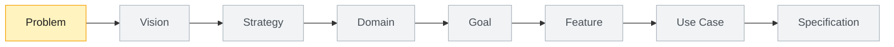

# Product Context

```yaml
id: PRODUCT-TBD
type: product
name: TBD Product
status: draft
owner_skill: Product Orchestrator
slug: product

parents: []

children:
  - foundation/problem
  - foundation/vision
  - foundation/strategy
  - domains

depends_on: []
used_by:
  - releases
related:
  - .product/framework.json

documents:
  canonical: README.md
  problem: foundation/problem/problem.md
  vision: foundation/vision/vision.md
  strategy: foundation/strategy/strategy.md

delivery:
  level: L0
  priority: P0
  depends_on: []
  rationale: Product foundation must exist before domains, features, and implementation planning.

open_questions:
  - What product name, primary audience, and first domain should replace the starter placeholders?

decisions: []
next_recommended_skill: Problem Discovery AI
```

## Purpose

This file orients agents at the product root. Replace TBD values as soon as the product has a real name, owner, and first validated problem.

## Current Flow



## Bootstrap Rule

Do not create domains or features until `foundation/problem/problem.md`, `foundation/vision/vision.md`, and `foundation/strategy/strategy.md` contain product-specific content.
